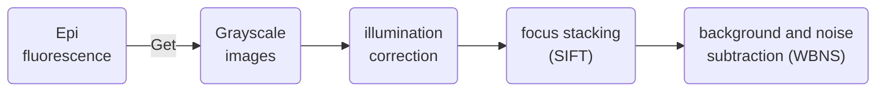
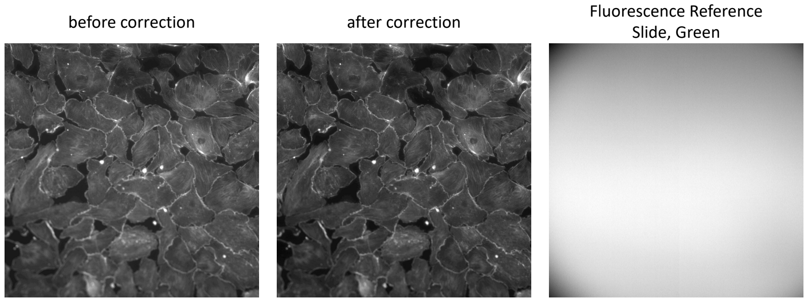
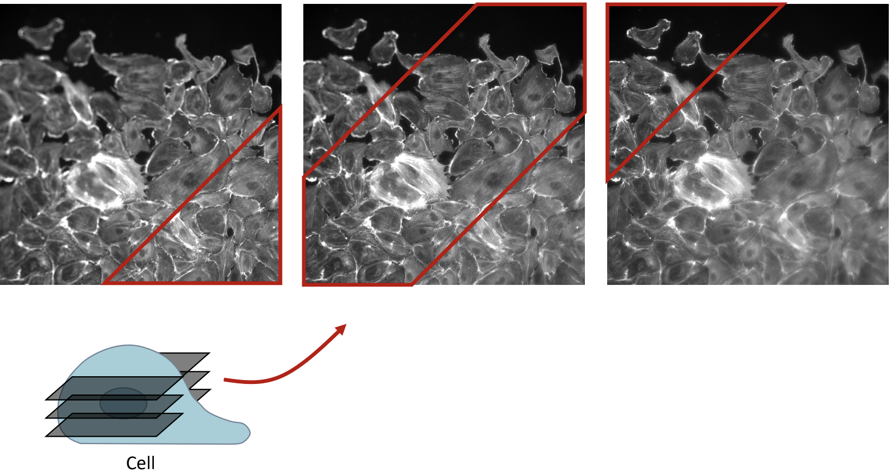
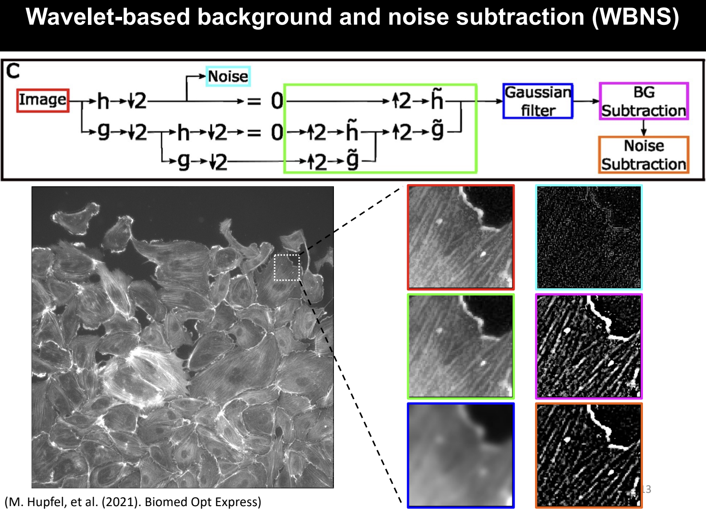
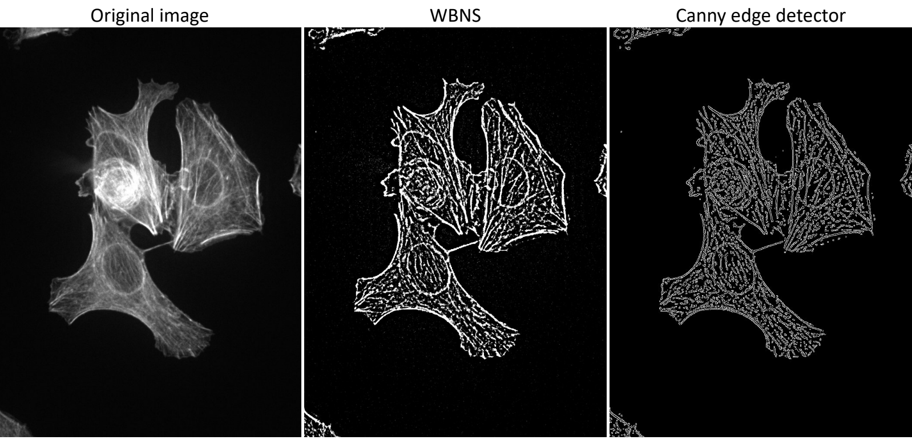
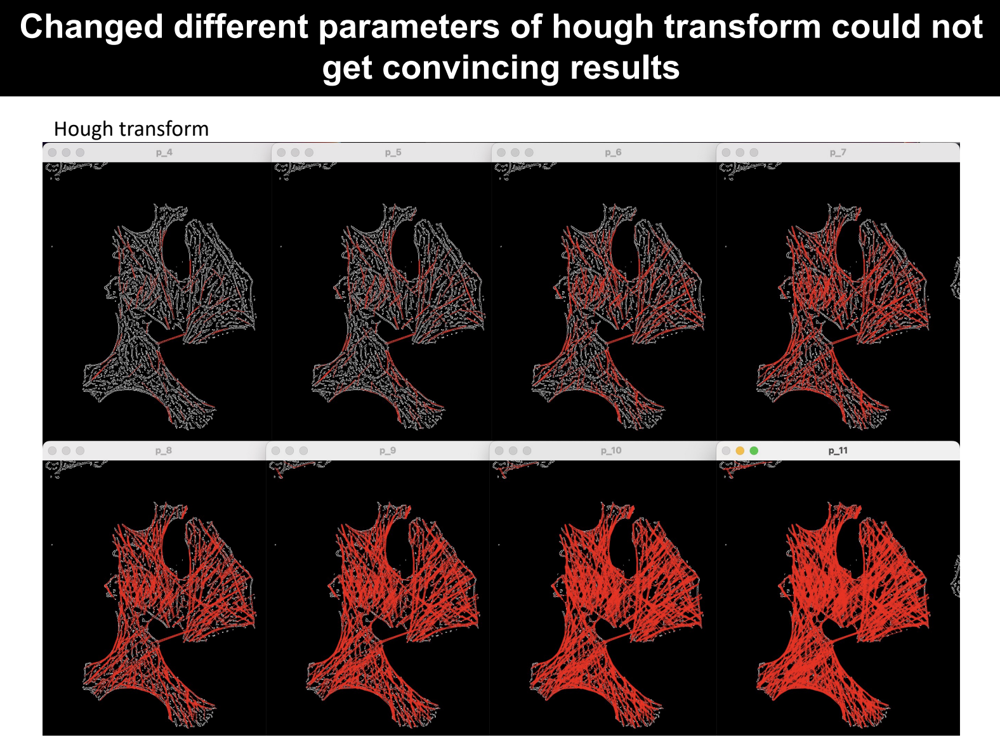
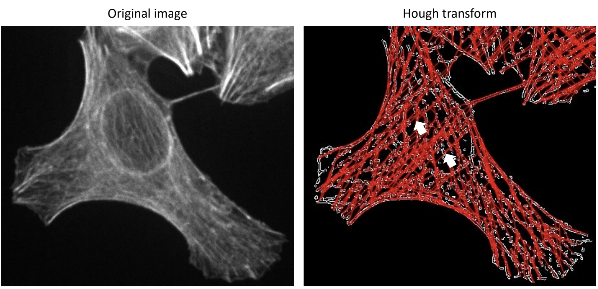
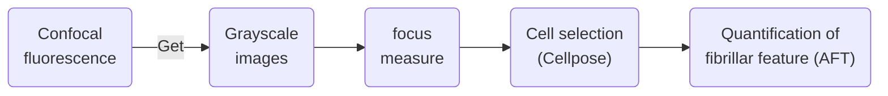
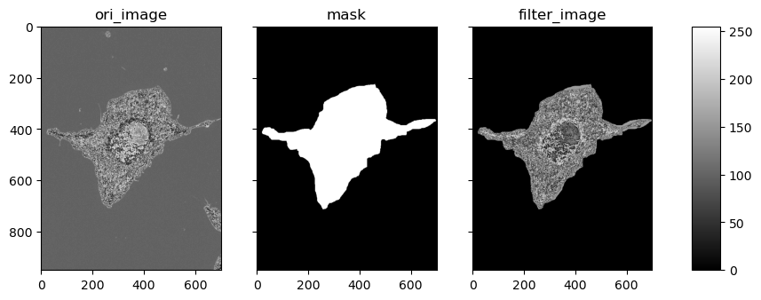
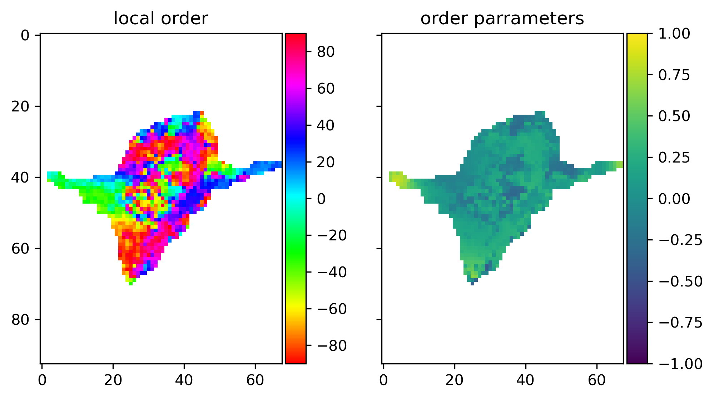

# ccClub_project

### Members and Purpose
I teamed up with my senior colleagues in PhD programs from graduate school I studied before. One of my team member is in Immunology PhD program. Based on his challenge on analyzing cytoskeleton of cell images generated from microscopy. Therefore, **our project aims to quantify the orientation of cytoskeleton.**

### Approach_I
Initailly, we utilized cell images from epi microscopy cell images. Prior to proceeding the cytoskeleton processing, we would like to address the issues of the background and noises of images. We accomplished it by serial processes including correcting by subtracting fluorescence-background, stacking z-scale through scale-invariant feature transform (SIFT)[[1]](#1) and doing Wavelet-based background and noise subtraction (WBNS)[[2]](#2).  



Here are the details of these steps: 


#### Illumination correction 
For setting up the fluorescence background for each channel, we subtract fluro-off (c_off) from  9 fluro-on views to get the reference (c_ref) and mean (c_mean) background fluorescence values. Then, normalize each image using following calculation.
```math
img_{out}= \frac{img_{in}-c_{off}}{c_{ref}} \times c_{mean}
```

We obtained the images with fluorescence background from microscopy. As a first step, we will subtracting the fluorescence background from images, as shown in figure below.  

```python
# save ref and mean fluorescence background values to dict.
c_ref= {k:(v-c_off) for k,v in c_on.items()}
c_mean= {k:v.mean() for k,v in c_ref.items()}
... ...
# normalize each z-stack image with mean fluorescence value after subtracting c-off from each image
t_array= (t_array-c_off)/c_ref[channel[i]]*c_mean[channel[i]]
```

<br>
#### Focus stacking
Due to variation of focus of images within z-stack of one view as shown in figure below.

  

We apply the focus_stack function to each view of images to merge all focuses into one image.

```python
def focus_stack(self, image_files: List[np.ndarray]) -> np.ndarray:

        # read images
        image_matrices = self._read_images(image_files) 
        # align images by SIFT
        images = self._align_images(image_matrices) 
        # compute laplacian of each image 
        laplacian = self._compute_laplacian(images) 
        # use bitwise-not with maxima mask to images
        focus_stacked = self._find_focus_regions (images, laplacian) 
        return focus_stacked
```
<br>
### Background and noise subtraction
Following the focus_stack, we use WBNS to reduce background and noise signals. 

  
<br>
We proceeded to identify the cytoskeleton shape using Canny edge detection and Hough transform algorithm. But, it failed to get the specific and accurate lines.  
<br>

<br>

<br>


### Approach_II
We found it difficalt to identify cytoskeleton signals in cell images generated from Epi-fluorescence micropscopy. We switched to use spinning-disk confocal microscopy for it can eliminate the out-of-focus glare. Also, we found another way to select cell of interest by using Cellpose[[3]](#3), and quntify the cytoskeleton orientation through fourier transform[[4]](#4).
<br>

<br>

#### Focus measure
In addition to the focus stacking process mentioned earlier, we actually calcuated focus measure scores for images to determined the first image to be used in focus stacking. But for images generated from confocal microscopy, we would only selected the image with the highest focus measure score for further analysis using Cellpose.
```python
def fmeasure(Img): #'GRAT' Thresholded gradient (Snatos97)
    Ix= Img[:]
    Iy= Img[:]
    Iy= np.vstack((np.diff(Iy, axis=0),Img[-1]))
    Ix= np.hstack((np.diff(Ix, axis=1),Img[:,-1:]))
    FM= np.fmax(abs(Ix),abs(Iy))
    FM= FM.sum()/np.count_nonzero(FM)
    return FM
```
<br>

#### Cells selection
In order to calculate each cell one by one, minimizing the impact from other cells, and set up train model for further model building, we use the Cellpose GUI to select cells mask manually and calculate the actin intensity for each cell.



#### Quantification of fibrillar feature
After selecting cell, we calculated fibrillar feature alignment by Alignment by Fourier Transform (AFT). AFT calculate the angle and eccentricity of orientation based on the fast fourier transform image moments. Then, we imported image local alignments to calculate_order_parameter function to measure how aligned fibrillar features were within adjacent windows.
<!-- add padd note for cell pixels near to margin-->
<!-- add order list for varification  -->


### Conclusion
Throughout this project, we extensively read lots of references and explored different kinds of python libraries in order to find the most suitable methods to achieve our objectives. So far, we have experienced two kinds of approaches to measure the intensity and orientation of cytoskeleton, and found that the second approach was better to attain our purposes. We are continuing our progress in this project and strive to develop a complete image analysis pipeline tailored to our needs.  


### References 

<a id="1">[1]</a> Lowe, D.G. Distinctive Image Features from Scale-Invariant Keypoints. International Journal of Computer Vision 60, 91–110 (2004). [Github repo](https://github.com/momonala/focus-stack/blob/master/focus_stack/focus_stack.py)  
<a id="2">[2]</a> Hüpfel M, Yu Kobitski A, Zhang W, Nienhaus GU. Wavelet-based background and noise subtraction for fluorescence microscopy images. Biomed Opt Express. 2021;12(2):969-980. [Github repo](https://github.com/NienhausLabKIT/HuepfelM/blob/master/WBNS/python_script/WBNS.py)  
<a id="3">[3]</a> Stringer C, Wang T, Michaelos M, Pachitariu M. Cellpose: a generalist algorithm for cellular segmentation. Nat Methods. 2021;18(1):100-106. [Github repo](https://github.com/MouseLand/cellpose)  
<a id="4">[4]</a> Marcotti S, de Freitas DB, Troughton LD, et al. A workflow for rapid unbiased quantification of fibrillar feature alignment in biological images. Front Comput Sci. 2021;3:745831. [Github repo](https://github.com/OakesLab/AFT-Alignment_by_Fourier_Transform/tree/master/Python_implementation)  

<!-- git-repo
WBNS: https://github.com/NienhausLabKIT/HuepfelM/blob/master/WBNS/python_script/WBNS.py -->
